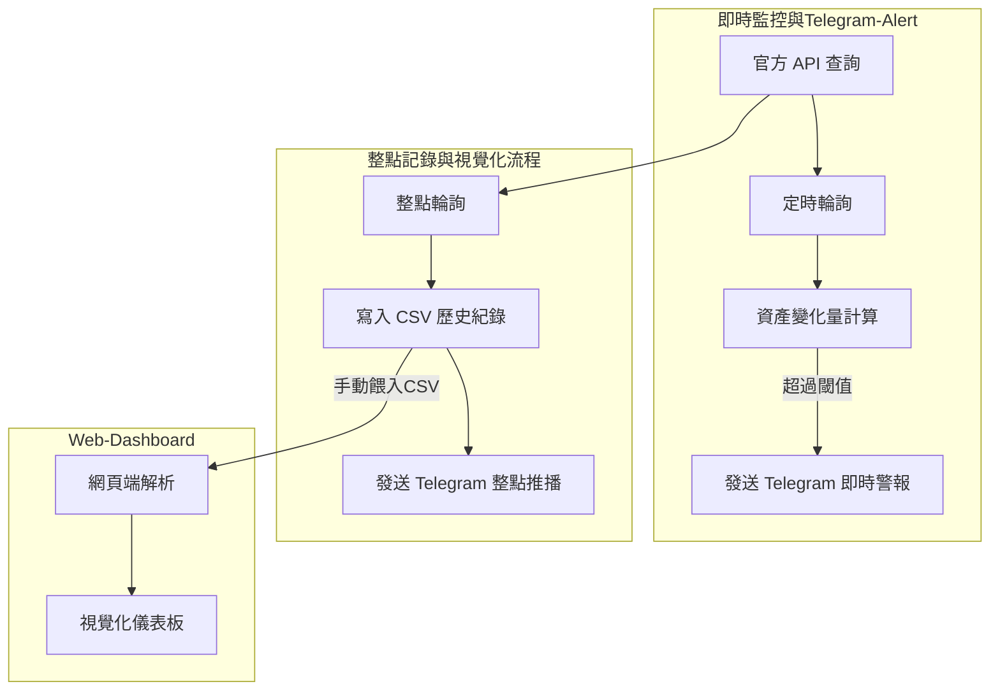

# LIT Buyback Monitor Bot — 平台代幣回購監控與 Telegram alarm 系統 ( Vibe Coding )

本專案為一套 **即時監控 Lighter Perp DEX 官方 Buyback 行為** 的自動化系統，  透過 **官方 API** 追蹤平台方針對平台代幣 **LIT** 的回購執行情況，  並提供 **歷史紀錄、趨勢分析、視覺化儀表板與 Telegram alarm**。

> ⚠️ 本專案原始碼未公開（涉及私人使用與 API 金鑰安全考量），  
> 此 Repository 用於展示系統架構、工程設計與實作能力。

---

## 📌 專案背景與目標

**LIT 為 Lighter Perp DEX 平台代幣**，平台方會定期執行 Buyback 機制，  將協議收入用於回購代幣，對市場價格與投資決策具有高度參考價值。

本專案目標為建構一套 **長期穩定運作（24/7）** 的 Buyback 監控系統，  即時追蹤平台方回購行為，協助進行：

- 即時追蹤官方 Buyback 行為
- 異常大額交易即時警報
- 長期數據留存並視覺化 Buyback 趨勢

並用來輔助 :

- 回購強度評估   
- 長期趨勢分析  
- 投資決策輔助  

---

## 🏗 系統架構

---

## 🚀 核心功能

- 透過官方 API 即時擷取 Buyback 數據  
- Buyback 變化量計算  
- 長期歷史資料累積與回溯  
- Buyback 強度分析  
- Telegram 即時 alarm  
- Web dashboard 視覺化儀表板  

---

## 📊 系統畫面展示

# dashboard showcase

# Telegram alarm showcase

